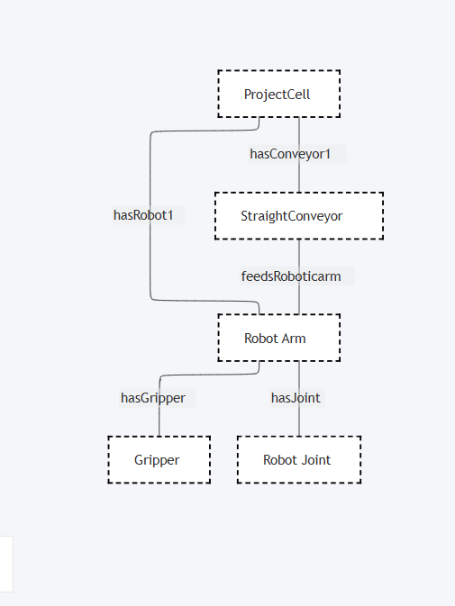

# DTDL Modeling Tips

## Example usage and output



- Run your parser from the src folder as it contains all the Json files. 
- add devices as you 
## 1. General Rules

Each model requires:

- `@id` → valid DTMI (e.g., `dtmi:ex:domain:RobotArm;1`)
- `@type` → always `"Interface"`
- `@context` → `"dtmi:dtdl:context;2"`

```bash
dtmi:ex:domain:RobotArm;1  

# almost like folder but then if you place them in seperate folder they cant communicate

/dtmi/ex/domain/robotarm-1.json

```

All `contents` name fields must be unique inside an interface.

Use `camelCase` or `snake_case` for `name`; spaces and special characters are not allowed.

Use `displayName` for human-readable names with spaces.

## 2. Types of Contents

- **Property**: persistent or stateful values
- **Telemetry**: live/streaming values
- **Command**: actions that can be invoked
- **Relationship**: links to independent twins
- **Component**: embedded models that are not independent

## 3. Enums

Used when property values are constrained to a fixed set.

Must define `valueSchema` and `enumValues`.

```bash
{
  "@type": "Property",
  "name": "status",
  "schema": {
    "@type": "Enum",
    "valueSchema": "string",
    "enumValues": [
      { "name": "Idle", "enumValue": "idle" },
      { "name": "Running", "enumValue": "running" },
      { "name": "Fault", "enumValue": "fault" }
    ]
  }
}
```

## 4. Relationships vs Components

**Use Relationship:**

- For devices/components that are independent entities
- When parts can be swapped, detached, or reused

**Use Component:**

- For embedded parts that do not exist independently
- When tightly coupled with the parent lifecycle

## 5. Multiplicity Rules

- `minMultiplicity` must always be `0`
- `maxMultiplicity` must be an integer between `1` and `500`

Example: a robot with up to 6 joints:

```bash
{
  "@type": "Relationship",
  "name": "hasJoint",
  "target": "dtmi:ex:domain:RobotJoint;1",
  "minMultiplicity": 0,
  "maxMultiplicity": 6
}
```

## 6. Ontology Patterns

**Container model (system)**

- Example: `ProjectCell`
- Relationships like `hasRobotArm`, `hasConveyor`

**Device model**

- Example: `RobotArm`, `StraightConveyor`
- Defines properties, telemetry, commands

**Part model**

- Example: `Joint`, `Gripper`
- Represented either as relationships or components

## 7. Twin Graphs

- **Models** = type definitions
- **Twins** = actual instances
- **Relationships** between twins form the graph

Example:

```bash
ProjectCell
 ├─ hasConveyor → StraightConveyor
 │                 └─ feeds → RobotArm
 └─ hasRobotArm → RobotArm
                   ├─ hasJoint → RobotJoint (x6)
                   └─ hasGripper → Gripper
```


# Digital Twin for Modular Unmanned Vehicles
## Project Requirements Document

---

## 1. Executive Summary

System enables rapid onboarding of physical unmanned vehicles and their modular components into a unified digital twin environment. Core value proposition: reduce time-to-simulation from weeks (traditional CAD + manual setup) to minutes (sensor discovery + ontology instantiation).

---

## 2. Functional Requirements

### 2.1 Asset Onboarding

**REQ-2.1.1: Automated Module Discovery**
- System shall detect connected hardware modules via network scan (CAN, MQTT, ROS topics, MAVLink)
- System shall extract module metadata: serial number, firmware version, capabilities, I/O specifications
- System shall validate module compatibility against existing vehicle configuration
- Discovery shall complete within 60 seconds for standard modular vehicle

**REQ-2.1.2: Semantic Asset Registration**
- User provides minimal input: vehicle model name, base chassis identifier
- System shall automatically instantiate ontology individuals for that vehicle
- System shall link discovered modules to their ontology classes (Motor, BatterySensor, Lidar, etc.)
- System shall generate datasheet URLs and calibration parameters from module registry

**REQ-2.1.3: Configuration Capture**
- Capture physical attachment points (mount location, orientation relative to vehicle frame)
- Capture electrical topology (power bus assignments, communication protocol per module)
- Capture constraints: weight budget, power draw limits, data throughput requirements
- Configuration shall be serializable to standardized format (JSON-LD preferred)

**REQ-2.1.4: Digital Twin Instantiation**
- Generate simulation model (URDF for ROS/Gazebo) from captured configuration
- Instantiate physics parameters from module specifications
- Generate sensor simulation pipelines (lidar, camera, IMU from discovered hardware specs)
- Launch simulation environment without manual intervention

### 2.2 Ontology Model

**REQ-2.2.1: Class Hierarchy**
- PhysicalEntity (root)
  - Vehicle (base structure)
    - ModularVehicle (our domain)
      - GroundVehicle
      - AerialVehicle
      - AquaticVehicle
  - Module (swappable components)
    - PropulsionModule (motors, actuators)
    - SensingModule (cameras, lidar, IMU, GPS)
    - PayloadModule (custom mission equipment)
    - PowerModule (batteries, power distribution)
    - StructuralModule (frames, connectors)
  - Sensor (instantiated from SensingModule)
  - Constraint (operational/physical limits)

**REQ-2.2.2: Property Definitions**
- Object Properties:
  - hasModule (Vehicle → Module)
  - attachedAt (Module → AttachmentPoint)
  - poweredBy (Module → PowerSource)
  - communicatesVia (Module → CommunicationBus)
  - constrainedBy (Module → Constraint)
  - observedBy (PhysicalPhenomenon → Sensor)

- Data Properties:
  - serialNumber (xsd:string)
  - massKg (xsd:float, with constraints)
  - powerDrawWatts (xsd:float)
  - firmwareVersion (xsd:string)
  - calibrationTimestamp (xsd:dateTime)
  - operationalStatus (enum: active, degraded, failed)
  - position3D (geometric representation)
  - orientation (quaternion)

**REQ-2.2.3: Constraints and Rules**
- Logical constraints (SHACL or OWL):
  - Total vehicle mass <= maxGrossWeight
  - Sum of module power draw <= battery capacity
  - Communication bandwidth allocation not oversubscribed
  - Module attachment points must be compatible (mechanical standard)
  - Sensor mounting must maintain calibration range

- Temporal constraints:
  - Sensors require recalibration every N hours
  - Firmware version compatibility windows
  - Module expected lifetime tracking

**REQ-2.2.4: Data Types**
- GeometricRepresentation (SE3 transforms: position + orientation)
- ModuleCapability (name, input/output specifications, processing latency)
- CalibrationRecord (timestamp, parameters, validation status)
- HealthMetric (battery state-of-health, motor efficiency, sensor drift)

### 2.3 Digital Twin Synchronization

**REQ-2.3.1: State Binding**
- Ontology individuals shall maintain real-time binding to physical device state
- Reading cycle latency: < 100ms for critical sensors, < 1s for telemetry
- Binding shall handle intermittent connectivity (queue state updates, reconcile on reconnect)
- Ontology updates trigger simulation state changes within 50ms

**REQ-2.3.2: Bidirectional Mirroring**
- Simulation can command physical vehicle (send motor commands, adjust parameters)
- Physical vehicle state updates propagate to simulation
- Command execution tracking: log success/failure, timestamps, latency

---

## 3. System Architecture Requirements

**REQ-3.1: Modular Architecture**
- Ontology engine (OWL reasoning, SHACL validation)
- Asset discovery service (protocol handlers for CAN, MQTT, MAVLink, ROS)
- Configuration compiler (URDF generator, physics parameter mapper)
- Simulation bridge (ROS 2 interface, Gazebo plugin)
- State synchronization layer (message routing, conflict resolution)

**REQ-3.2: Extensibility**
- Plugin system for new module types (users define new Module subclasses + properties)
- Custom discovery protocol handlers (protocol adapter interface)
- Custom constraint validators (user-defined SHACL rules)
- Custom simulation exporters (generate configs for different simulators)

**REQ-3.3: Storage**
- Ontology persistence: RDF triple store (Fuseki, GraphDB, or embedded Jena)
- Configuration cache: relational DB for fast vehicle lookup (PostgreSQL + JSON columns)
- Time-series DB for sensor historical data (InfluxDB, TimescaleDB)
- File storage for URDF/mesh assets

---

## 4. Non-Functional Requirements

**REQ-4.1: Performance**
- Vehicle onboarding (discovery → simulation launch): < 5 minutes end-to-end
- State query response: < 50ms for single vehicle, < 500ms for fleet
- Ontology reasoning queries: < 100ms
- Simulation frame rate: 60Hz minimum

**REQ-4.2: Reliability**
- Asset registry redundancy (3+ replicas minimum)
- State consistency: eventual consistency model with < 5s propagation delay
- Graceful degradation: system operates with partial hardware unavailability
- Watchdog: detect failed modules, remove from active configuration

**REQ-4.3: Scalability**
- Support 100+ modular vehicles simultaneously
- Support 1000+ total modules in system
- Ontology reasoning must not degrade beyond linear complexity
- State updates shall be fan-out efficient (pub/sub, not polling)

**REQ-4.4: Security**
- Module authentication: verify hardware identity before accepting into ontology
- Configuration signing: tamper-proof vehicle configuration files
- Access control: role-based permissions (admin, operator, observer)
- Audit logging: all asset onboarding events

---

## 5. Data Requirements

**REQ-5.1: Module Datasheet Integration**
- System shall maintain registry of module types with specifications
- Datasheet sources: manufacturer APIs, local database, user uploads
- Automatic parameter extraction: mass, power envelope, sensor specs
- Support versioning: track specification changes across firmware updates

**REQ-5.2: Calibration Metadata**
- Capture sensor calibration matrices (intrinsics for cameras, accelerometer bias, etc.)
- Store timestamps, validation results, recalibration intervals
- Link calibration to simulation (update sensor models when calibration changes)

**REQ-5.3: Environmental Context**
- Support terrain type specification (for physics simulation)
- Weather conditions (affects sensor performance, motor efficiency)
- GPS datum (for coordinate system consistency)

---

## 6. Interface Requirements

**REQ-6.1: User Interfaces**
- Web dashboard: vehicle list, onboarding wizard, simulation launcher
- Onboarding wizard: guided flow (chassis selection → module discovery → constraints → launch)
- Simulation UI: real-time vehicle state visualization, command interface
- Ontology explorer: browse module types, view constraints, inspect reasoning

**REQ-6.2: API Interfaces**
- REST API: CRUD operations on vehicles, modules, configurations
- gRPC: real-time state updates (low latency)
- ROS 2 nodes: integrate with existing ROS infrastructure
- GraphQL: flexible ontology queries (filter modules by properties)
- MQTT: broadcast vehicle state for external systems

**REQ-6.3: File Formats**
- Configuration: JSON-LD (semantic + JSON) or OWL/RDF
- Simulation models: URDF (for Gazebo)
- Datasheets: PDF + structured metadata (CSV or JSON)
- Hardware interface specs: OpenAPI or protobuf definitions

---

## 7. Use Cases

**UC-7.1: New Vehicle Onboarding**
- Technician powers on new modular vehicle
- System auto-discovers all modules via CAN bus
- User confirms vehicle model in web UI
- Constraints auto-populated from module specs
- URDF generated, simulation launched with physics-accurate model
- Operator immediately able to test mission logic in simulation

**UC-7.2: Module Swap**
- Technician removes motor module, installs upgraded version
- System detects change (module missing, new serial number appeared)
- Ontology updated automatically
- Simulation model recompiled with new motor characteristics
- Motion profile tests re-run to validate performance

**UC-7.3: Sensor Calibration**
- System prompts recalibration due after 100 flight hours
- Calibration routine executed, parameters captured
- Ontology individuals updated with new calibration matrices
- Simulation sensor models regenerated
- Validation checks run (e.g., point cloud quality)

**UC-7.4: Fleet Management**
- Operator views 20 vehicle instances in ontology
- Queries: "show all vehicles with battery < 30%"
- Queries: "which vehicles can carry 5kg payload?"
- Simulation scenarios generated per-vehicle configuration

---

## 8. Testing Requirements

**REQ-8.1: Validation**
- SHACL shape validation: all vehicle configurations must satisfy constraints
- Consistency checks: no cycles in dependency graphs
- Simulation fidelity: compare simulated sensor readings vs hardware ground truth

**REQ-8.2: Test Coverage**
- Module discovery (CAN, MQTT, MAVLink protocols)
- Ontology reasoning (constraint satisfaction, query performance)
- URDF generation (physics accuracy, collision models)
- State synchronization (eventual consistency, conflict resolution)

---

## 9. Success Metrics

- Onboarding time: reduce from 3 weeks (CAD modeling) to 3 minutes
- Module library: support 50+ distinct module types in year 1
- Adoption: 10+ fleet operators using system
- Simulation-to-reality correlation: < 5% error on motion predictions
- Mean time to resolve hardware changes: < 2 minutes

---

## 10. Constraints & Assumptions

- Assumes modular vehicles follow standard mechanical attachment (e.g., DIN or ISO standard)
- Assumes reliable network connectivity for state synchronization (failover required for intermittent)
- Assumes module firmware is semi-stable (doesn't change mid-flight)
- Out of scope: path planning, SLAM, mission autonomy (digital twin provides state/constraints only)


# 6 Traits for Digital Twin Efficiency Analysis

## Trait 1: Energy Efficiency (Wh/km)

**What it measures:** Battery capacity consumed per unit distance traveled.

**Formula:**
```
Energy_Efficiency = Total_Battery_Capacity_Wh / Max_Range_km
```

**Depends on:**
- Motor efficiency (RPM to force conversion)
- Motor power draw (W)
- Wheel friction coefficient
- Vehicle mass (heavier = more energy to move)
- Terrain (uphill costs more)
- Battery chemistry (affects usable Wh vs rated Wh)

**Query example:**
```sparql
SELECT ?vehicle ?efficiency
WHERE {
  ?vehicle dt:hasModule ?motor .
  ?motor a dt:Motor ;
    dt:maxRPM ?rpm ;
    dt:powerDrawWatts ?power .
  ?vehicle dt:hasModule ?battery ;
    dt:capacityWh ?capacity .
  BIND((?capacity / (?rpm * 0.1)) AS ?efficiency)
  FILTER(?efficiency < 50)  # Find inefficient vehicles
}
```

**What happens when you swap modules:**

| Change | Effect | Mission Impact |
|--------|--------|-----------------|
| Upgrade motor (higher RPM, same power) | Efficiency improves (faster = shorter time = less total energy) | Longer range ✓ |
| Upgrade motor (higher power draw) | Efficiency worse (more energy consumed per km) | Shorter range ✗ |
| Add heavier battery (more capacity but +200g) | Slight efficiency loss (more mass to move) but net gain (more energy onboard) | Range improves if capacity gain > efficiency loss ✓ |
| Swap to lighter motor | Efficiency improves but loses torque | Can't climb hills, mission fails ✗ |

---

## Trait 2: Power Budget Utilization (%)

**What it measures:** Percentage of available battery power being drawn under load.

**Formula:**
```
Power_Utilization = Active_Module_Power_Draw_W / Battery_Max_Discharge_Rate_W * 100
```

**Depends on:**
- Sum of all module power draws (motors, sensors, compute)
- Battery discharge rating (C-rating: 5Ah 10C battery can output 50A max)
- Duty cycle (what % of time each module is active)
- Environmental factors (cold reduces battery power delivery)

**Query example:**
```sparql
SELECT ?vehicle ?total_power ?available_power ?utilization
WHERE {
  ?vehicle dt:hasModule ?module .
  ?module dt:powerDrawWatts ?power .
  BIND(SUM(?power) AS ?total_power)
  
  ?vehicle dt:hasModule ?battery ;
    dt:voltage ?voltage ;
    dt:capacityAh ?capacity ;
    dt:cRating ?crating .
  BIND((?voltage * ?capacity * ?crating) AS ?available_power)
  BIND((?total_power / ?available_power * 100) AS ?utilization)
  FILTER(?utilization > 80)  # Warning: high utilization
}
```

**What happens when you swap modules:**

| Change | Effect | Mission Impact |
|--------|--------|-----------------|
| Add high-power lidar (+30W) | Utilization jumps from 60% → 80% | Risk: spikes could brown-out vehicle mid-mission ✗ |
| Swap 2x 50W motors for 1x 80W motor (parallel to series) | Power draw changes (depends on control strategy) | If series: same power, but torque concentrated → mission critical ⚠ |
| Upgrade to 2S battery (48V → 96V) same Ah | Available power doubles (V increases discharge rate) | Utilization drops 80% → 40%, mission margin improves ✓ |
| Remove one motor (single-wheel drive) | Power draw halves but torque halves | Mission fails (can't turn) ✗ |

---

## Trait 3: Thermal Headroom (°C)

**What it measures:** How close components are to thermal throttling limits.

**Formula:**
```
Thermal_Headroom = (Max_Operating_Temp - Current_Component_Temp) - Safety_Margin
```

**Depends on:**
- Ambient temperature
- Motor load (duty cycle)
- Battery state-of-health (aged battery generates more heat)
- Heat dissipation (enclosure design, airflow)
- Component cooling capacity

**Query example:**
```sparql
SELECT ?vehicle ?component ?current_temp ?headroom
WHERE {
  ?vehicle dt:hasModule ?component .
  ?component dt:currentTemperature ?current_temp ;
    dt:maxOperatingTemp ?max_temp .
  BIND((?max_temp - ?current_temp - 5) AS ?headroom)  # 5°C safety margin
  FILTER(?headroom < 10)  # Warning: low thermal headroom
}
```

**What happens when you swap modules:**

| Change | Effect | Mission Impact |
|--------|--------|-----------------|
| Upgrade to motor with better heat sinking | Headroom improves, can sustain higher load | Longer mission duration ✓ |
| Add insulation (weatherproofing) | Headroom decreases (worse heat dissipation) | Risk of throttling in summer / high-load scenarios ✗ |
| Swap battery to newer chemistry (LiPo → LiFePO4) | Same capacity but generates 30% less heat | Headroom improves significantly ✓ |
| Double motor power (add second motor) | More heat generation from drives | Headroom drops, may throttle under heavy load ✗ |
| Ambient temp rises 20°C (desert mission) | All headroom drops proportionally | If already marginal, mission fails ✗ |

---

## Trait 4: Sensor Fusion Accuracy (Confidence %)

**What it measures:** Reliability of vehicle position/orientation estimate for navigation.

**Formula:**
```
Fusion_Accuracy = (Weight_GPS * GPS_Quality + Weight_IMU * IMU_Quality + Weight_Lidar * Lidar_Quality) / Sum_Weights
```

Quality depends on:
- Sensor calibration status (stale calibration = lower confidence)
- Environmental conditions (GPS denied areas, reflective surfaces for lidar)
- Sensor health (drift detection)

**Query example:**
```sparql
SELECT ?vehicle ?sensor ?calibration_age ?confidence
WHERE {
  ?vehicle dt:hasModule ?sensor .
  ?sensor a dt:Sensor ;
    dt:lastCalibration ?cal_date ;
    dt:maxCalibrationAge ?max_age .
  BIND(NOW() - ?cal_date AS ?age)
  BIND(IF(?age > ?max_age, 0.5, 1.0) AS ?confidence)
  FILTER(?confidence < 0.8)  # Low confidence warning
}
```

**What happens when you swap modules:**

| Change | Effect | Mission Impact |
|--------|--------|-----------------|
| Upgrade to higher-res lidar | Accuracy improves (better feature detection) | Autonomous missions more reliable ✓ |
| Remove GPS (indoor mission) | Accuracy depends entirely on IMU + lidar fusion | Drift accumulates, mission fails without re-localization ✗ |
| Add RTK-GPS module | Accuracy jumps to cm-level | Precision missions (surveying) now possible ✓ |
| Mount IMU on flexible bracket (vibration) | Accuracy degrades (sensor noise increases) | Navigation confidence drops, mission aborts ✗ |
| Calibration expires (hasn't been recalibrated in 6 months) | Confidence drops even if hardware unchanged | Mission aborts until recalibration ✗ |

---

## Trait 5: Payload Capacity (kg remaining)

**What it measures:** How much additional mass can be added before exceeding vehicle limits.

**Formula:**
```
Remaining_Capacity = Max_Gross_Weight - Sum(Module_Masses) - Chassis_Mass
```

**Depends on:**
- Chassis weight rating (structural limit)
- Current module masses
- Margin for CG shift (when loading payload, center of gravity moves)

**Query example:**
```sparql
SELECT ?vehicle ?total_mass ?max_mass ?remaining ?percent_full
WHERE {
  ?vehicle dt:maxGrossWeight ?max_mass .
  ?vehicle dt:hasModule ?module .
  ?module dt:massKg ?mass .
  BIND(SUM(?mass) AS ?total_mass)
  BIND(?max_mass - ?total_mass AS ?remaining)
  BIND((?total_mass / ?max_mass * 100) AS ?percent_full)
  FILTER(?remaining < 0.5)  # Nearly at capacity
}
```

**What happens when you swap modules:**

| Change | Effect | Mission Impact |
|--------|--------|-----------------|
| Swap motor 150g → 200g (more power) | Remaining capacity drops 50g | May not fit payload + sensors ✗ |
| Swap battery 800g → 600g (lighter chemistry) | Remaining capacity increases 200g | Can now mount thermal camera (+150g) ✓ |
| Upgrade chassis (stronger frame, +300g) | Max gross weight increases 500g, but chassis heavier | Net gain: +200g payload capacity ✓ |
| Add 100g sensor without removing anything | Remaining capacity consumed | If < 100g left, violates constraints ✗ |

---

## Trait 6: Mission Completion Probability (%)

**What it measures:** Likelihood mission will complete successfully, given current configuration.

**Formula:**
```
Completion_Prob = P(Battery_Lasts) × P(Thermal_Safe) × P(Navigation_Accurate) × P(Payload_Secure)
```

**Depends on:**
- Energy efficiency vs. mission distance
- Thermal headroom vs. mission duration
- Sensor accuracy required vs. available
- Load margin for stability
- Weather forecast (affects all above)
- Component health (battery degradation, sensor drift)

**Query example:**
```sparql
SELECT ?vehicle ?mission ?prob_complete
WHERE {
  ?vehicle dt:plannedMission ?mission .
  ?mission dt:distance ?distance ; dt:maxDuration ?duration ; dt:minNavAccuracy ?acc_req .
  
  ?vehicle dt:energyEfficiency ?eff .
  ?vehicle dt:thermalHeadroom ?thermal .
  ?vehicle dt:sensorFusionAccuracy ?nav_acc .
  
  # Battery outlast? Need: distance * eff <= battery capacity
  BIND(IF((?distance * ?eff) <= (?vehicle.battery.capacity), 0.9, 0.1) AS ?prob_energy)
  
  # Thermal safe? Need: headroom > 0
  BIND(IF(?thermal > 0, 0.95, 0.2) AS ?prob_thermal)
  
  # Navigation accurate? Need: nav_acc >= req
  BIND(IF(?nav_acc >= ?acc_req, 0.95, 0.3) AS ?prob_nav)
  
  BIND(?prob_energy * ?prob_thermal * ?prob_nav AS ?prob_complete)
  FILTER(?prob_complete < 0.5)  # High risk mission
}
```

**What happens when you swap modules:**

| Change | Effect | Mission Status | Complete Prob |
|--------|--------|---|---|
| Upgrade motor (higher efficiency) | All traits improve | Mission now feasible | 0.2 → 0.85 ✓ |
| Add 50W lidar without upgrading battery | Power utilization ↑, thermal ↑, sensor acc ↑ | Trade-off: accuracy better but battery marginal | 0.70 → 0.65 ⚠ |
| Swap battery to 2x capacity | Energy margin huge, thermal better, payload capacity ↑ | Mission feasibility jumps | 0.2 → 0.95 ✓ |
| Replace motors with weaker versions (power save) | Everything degrades | Mission fails | 0.85 → 0.15 ✗ |
| Add payload (thermal camera +200g) without removing anything | Payload capacity hit, weight affects efficiency | May still complete if margin exists | 0.75 → 0.60 ⚠ |
| Environmental change: rain (GPS unreliable) | Sensor fusion accuracy drops | Mission navigation confidence drops | 0.80 → 0.40 ✗ |

---

## Propagation Flow: How Changes Cascade

```
Swap Motor (50W → 80W)
    ↓
Power_Budget_Utilization ↑ (60% → 85%)
    ↓
Thermal_Headroom ↓ (sensor will run hotter)
    ↓
Energy_Efficiency ↓ (more wasted heat)
    ↓
Mission_Completion_Probability ↓
    ↓
RESULT: Mission now infeasible in hot climates ✗

---

Upgrade Battery (48V 5Ah → 96V 5Ah, 2S)
    ↓
Power_Budget_Utilization ↓ (same W, higher V×I capacity)
    ↓
Thermal_Headroom ↑ (lower discharge rate = less heat)
    ↓
Payload_Capacity ↑ (slightly heavier, but capacity margin grows)
    ↓
Energy_Efficiency ↑ (less voltage sag, motor runs at peak)
    ↓
Mission_Completion_Probability ↑
    ↓
RESULT: Mission now feasible 200km away, hot climates okay ✓
```

---

## Queries You Can Actually Write

**"Show me all vehicles that can complete a 10km mission in 35°C ambient"**
```sparql
SELECT ?vehicle ?prob_complete
WHERE {
  ?vehicle dt:hasMission [ dt:distance 10 ; dt:ambientTemp 35 ] .
  ?vehicle :missionCompletionProb ?prob .
  FILTER(?prob > 0.8)
}
ORDER BY DESC(?prob)
```

**"If I swap motor X for motor Y on vehicle Z, what changes?"**
```python
# Pseudo-code
vehicle = ontology.get("SimpleBot-001")
current_efficiency = vehicle.query("dt:energyEfficiency")
current_completion_prob = vehicle.query("dt:missionCompletionProbability")

# Hypothetical swap
vehicle.swap_module("MOT-001", new_motor_spec)
new_efficiency = vehicle.query("dt:energyEfficiency")
new_completion_prob = vehicle.query("dt:missionCompletionProbability")

delta = {
  "efficiency_delta": new_efficiency - current_efficiency,
  "risk_delta": new_completion_prob - current_completion_prob,
  "feasible": new_completion_prob > 0.8
}
```

**"Which module swap gives me the best range-to-weight ratio?"**
```sparql
SELECT ?swap ?range ?weight ?ratio
WHERE {
  BIND(ontology.getVehicle("SimpleBot") AS ?base)
  # Generate all possible swaps from module library
  ?base dt:canUseModule ?new_module .
  BIND(copy(?base).swap(?new_module) AS ?swapped)
  ?swapped dt:maxRange ?range ; dt:totalMass ?weight .
  BIND(?range / ?weight AS ?ratio)
}
ORDER BY DESC(?ratio)
LIMIT 1
```